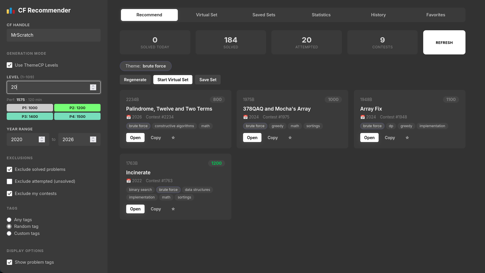

# CF-Recommender
A simple cf problem reccomender inspired from ThemeCP that covers QOL features missing in other recommendation systems.

## Features
* Create Problem Sets based on parameters -> year range, include & exclude tags, and choose rating.
* Choice between ThemeCP Levels or a rating range and number of problems
* Start Virtual Set with a stopwatch.
* Pause and archive the set anytime, and resume it when you deem fit.
* Show or hide tags.

## Problems Solved
* You can make it select recent problems or old problems as per convenience
* You can exclude or include tags as needed
* The stop watch system gives me less anxiety while still keeping time pressure.
* You can save your sets, which allows for easy revisit of your problems.

The website is all client side, and data is stored in the browser cache, so make sure to export/import your data when changing browsers. Do make backups as deleting the site data will reset the cache and hence your saved sets.

